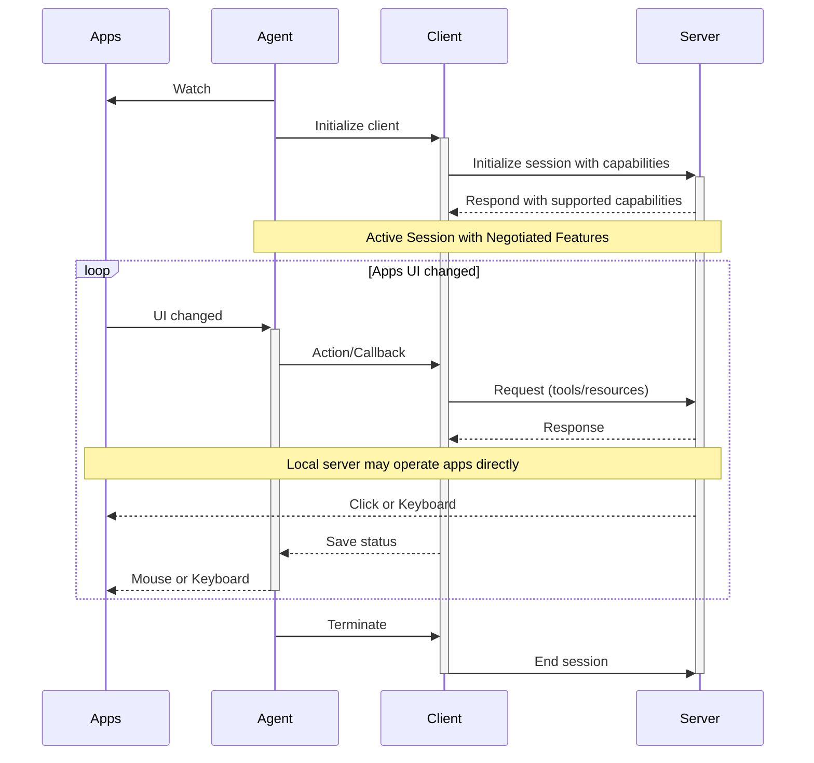

# a11yagt
An AI agent for improving accessibility

## 架构

```mermaid
sequenceDiagram
    participant Apps
    participant Agent
    participant Client
    participant Server

    Agent->>Apps: Watch
    Agent->>+Client: Initialize client
    Client->>+Server: Initialize session with capabilities
    Server-->>Client: Respond with supported capabilities

    Note over Agent,Server: Active Session with Negotiated Features

    loop Apps UI changed
        Apps->>+Agent: UI changed
        Agent->>Client: Action/Callback
        Client->>Server: Request (tools/resources)
        Server-->>Client: Response
        Note over Apps,Server: Local server may operate apps directly
        Server-->>Apps: Click or Keyboard 
        Client-->>Agent: Save status 
        Agent-->>-Apps: Mouse or Keyboard 
    end


    Agent->>Client: Terminate
    Client->>-Server: End session
    deactivate Server
```

借助MCP流程图，这里的Apps，代表被操作的应用。Agent通过监视Apps的界面发生变化而产生Action。